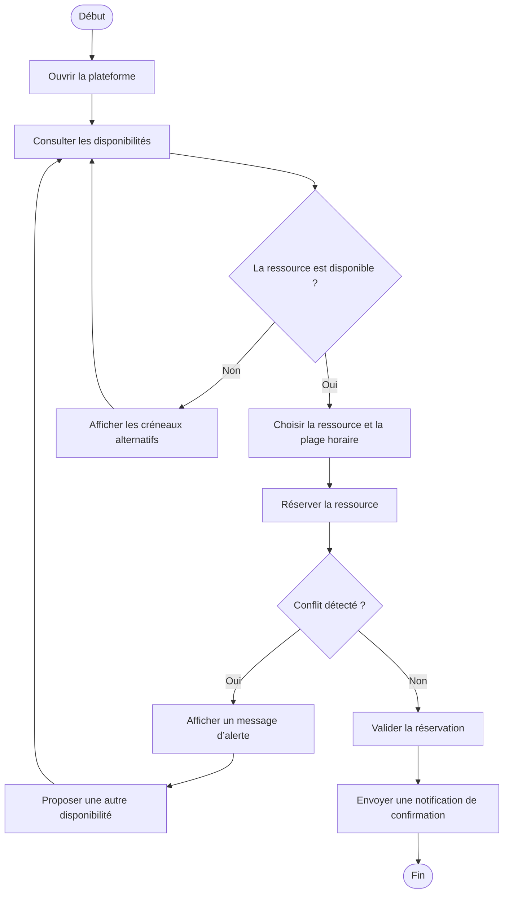
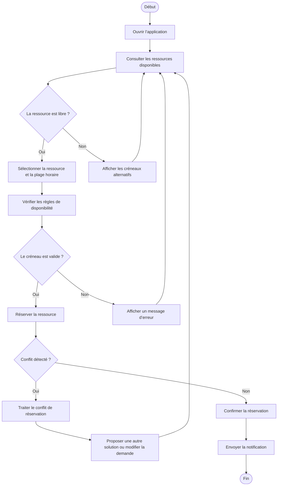

# Diagramme d'activité – ResourceHub

## Version générée par l'agent

### 1) Délimitation du système
Le système représente une application de réservation de ressources partagées, appelée ResourceHub. Il permet à un utilisateur interne de consulter les disponibilités, réserver une ressource, gérer ses réservations et recevoir une confirmation, tout en gardant le contrôle des conflits de réservation.

### 2) Acteurs externes retenus
- Employé : il réserve des ressources pour son travail quotidien.
- Gestionnaire / Administrateur de ressources : il supervise l’usage et valide les conflits.

### 3) Description du scénario
Le flux métier principal couvre la réservation d’une ressource jusqu’à sa validation ou son rejet.

### 4) Diagramme d’activité

### 5) Vérification des contraintes
- Nœud initial : oui, A
- Nœud final : oui, M
- Nombre d’actions métier : 7 (ouvrir, consulter, choisir, réserver, alerter, proposer, valider, notifier)
- Décision avec gardes : oui, la décision sur la disponibilité et le conflit
- Chemins : minimum 2 chemins
- Fork / join : non, car le scénario n’en nécessite pas

---

## Version corrigée par le groupe

### 1) Correctif de cadrage
Le système est bien délimité comme une application de gestion et de réservation de ressources partagées. Il centralise l’accès aux ressources et apporte une logique de validation sans réaliser de gestion comptable ou de maintenance technique.

### 2) Acteurs externes justifiés
- Employé : acteur principal qui consulte les ressources et passe les réservations.
- Gestionnaire / Administrateur de ressources : acteur de supervision, d’arbitrage et de contrôle des disponibilités.

### 3) Actions métier retenues
- Ouvrir l’application
- Consulter les ressources disponibles
- Sélectionner une ressource
- Vérifier la disponibilité
- Réserver la ressource
- Gérer le conflit de réservation
- Confirmer la réservation
- Recevoir la notification

### 4) Diagramme d’activité corrigé

### 5) Justification de la correction
Cette version corrige la première en clarifiant le parcours réel du processus métier. Elle ajoute une vraie vérification des règles de disponibilité, distingue clairement le cas “ressource indisponible” du cas “conflit détecté”, et garde un flux logique plus proche des contraintes opérationnelles du projet.

### 6) Vérification des contraintes
- Nœud initial : oui, A
- Nœud final : oui, P
- Nombre d’actions métier : 8
- Décision avec gardes : oui, deux décisions avec gardes
- Chemins : au moins 2 chemins
- Fork / join : non, justifié par l’absence de parallélisme réel dans le processus
- Versions : oui, version générée puis corrigée

---

## Conclusion
La version corrigée est celle qui doit être retenue pour la documentation finale : elle est plus claire, plus réaliste et mieux adaptée au contexte métier de ResourceHub.
