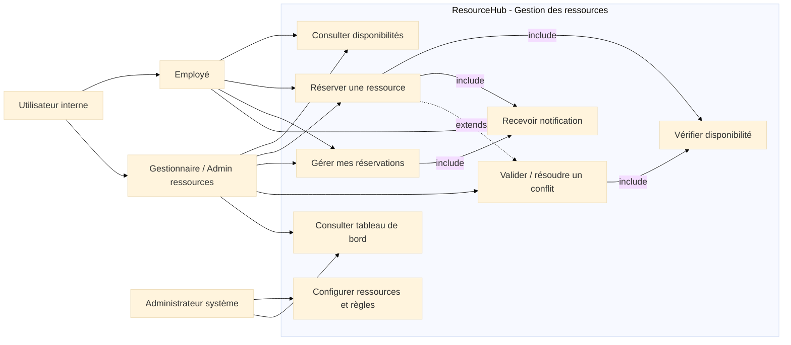
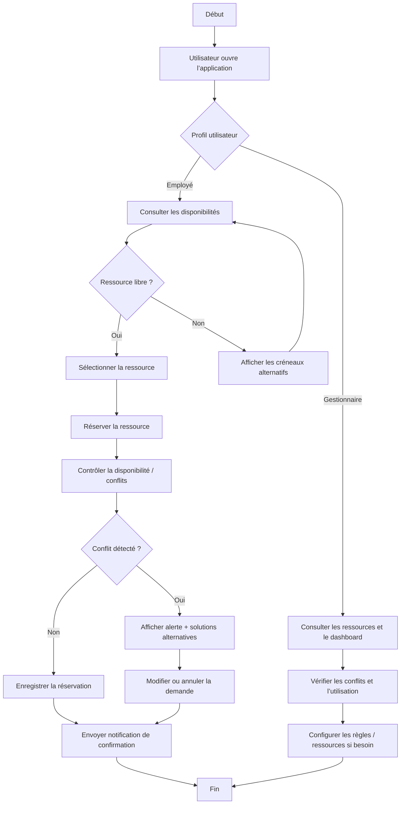
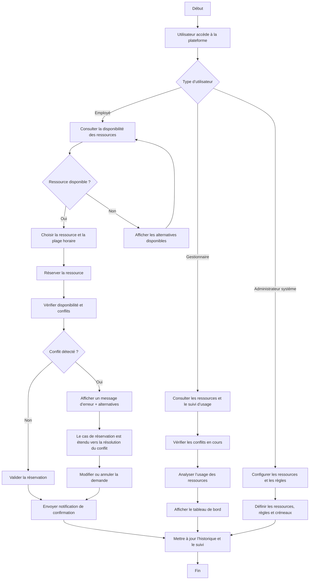

# Cadrage fonctionnel et diagramme UML – ResourceHub

## 1) Cadrage fonctionnel du projet

Le système cible une plateforme interne de consultation et de réservation de ressources partagées, dans un contexte d’entreprise ou de département. Son objectif est d’éviter les conflits d’accès, d’améliorer la visibilité des disponibilités et de sécuriser la gestion des réservations sans introduire de complexité inutile.

### Périmètre fonctionnel retenu
- Consultation des disponibilités par ressource et par plage horaire
- Réservation simple, rapide et traçable
- Gestion des réservations propres à l’utilisateur
- Contrôle des conflits de réservation
- Notifications de confirmation et de rappel
- Gestion administrative des ressources et des règles de disponibilité
- Suivi de statistiques globales pour l’administration

### Hors périmètre de la version cible
- Facturation et gestion budgétaire
- Maintenance technique des ressources
- Chat, collaboration avancée, vidéoconférence
- Application native mobile dédiée
- Analyse prédictive ou reporting avancé
- Intégration complète avec un écosystème tiers

---

## 2) Rôles déjà décidés

### Rôles fonctionnels du système
| Rôle | Type | Justification |
|---|---|---|
| Utilisateur interne | acteur générique | Représente tout employé ayant besoin de consulter ou réserver des ressources. |
| Employé | acteur métier | C’est le profil principal de réservation quotidienne : il consulte, réserve, modifie ou annule ses créneaux. |
| Gestionnaire / Administrateur de ressources | acteur métier | Il a une responsabilité opérationnelle sur l’allocation : validation des conflits, optimisation et supervision. |
| Administrateur système | acteur technique | Il configure les ressources, leurs règles de disponibilité et les paramètres du système. |

### Rôles projet de gouvernance
Les rôles du RACI ne sont pas des acteurs métier du système ; ils définissent la gouvernance du projet :
- Vous : décideur fonctionnel / propriétaire du produit
- Agent IA : responsable de l’implémentation et de la documentation
- Professeur : validateur fonctionnel et garant de conformité

---

## 3) Fonctionnalités retenues, superflues et refusées

### Fonctionnalités retenues
1. Consulter les disponibilités
   - Base du produit : sans visibilité on ne peut pas réserver correctement.
2. Réserver une ressource
   - Cœur du métier et usage principal.
3. Gérer les réservations personnelles
   - Modification, annulation, consultation de l’historique.
4. Recevoir des notifications
   - Confirme la réservation et limite les oublis.
5. Vérifier les conflits de réservation
   - Empêche les doubles allocations.
6. Configurer les ressources et les règles
   - Nécessaire pour l’administration technique.
7. Consulter les statistiques d’usage
   - Utile pour le gestionnaire, sans être complexe.

### Fonctionnalités superflues
Ces éléments ne sont pas indispensables à la version de base, mais peuvent être envisagés plus tard :
- Tableau de bord analytique avancé
- Suggestions automatiques de créneaux optimaux
- Ajout de participants à une réservation
- Export de statistiques enrichies
- Accès mobile optimisé hors navigateur

### Fonctionnalités refusées
Elles sont explicitement exclues du périmètre actuel :
- Gestion comptable et facturation
- Maintenance des équipements
- Collaboration avancée (chat / visio / fichiers)
- Authentification multi-facteur ou SSO avancé
- Reporting prédictif / intelligence d’usage

> La logique de conception est de rester sur une version robuste, lisible et exécutable : résoudre le vrai problème de gestion des ressources sans disperser le produit dans des fonctions non prioritaires.

---

## 4) Diagramme UML des cas d’utilisation

---

## 5) Justification des acteurs

### 1. Utilisateur interne
- Rôle générique de base.
- Il représente tout individu qui profite du système pour accéder à des ressources partagées.
- Son existence permet de modéliser la logique commune au niveau d’un employé ou d’un gestionnaire sans dupliquer tous les cas d’usage.

### 2. Employé
- C’est le profil d’usage quotidien le plus fréquent.
- Il a besoin surtout de consultation, réservation, et gestion de ses propres créneaux.
- Il est le principal bénéficiaire du gain de temps : au lieu de passer par des mails ou des appels, il fait la réservation directement.

### 3. Gestionnaire / Administrateur de ressources
- Il a un rôle de supervision et d’optimisation.
- Il doit pouvoir détecter les conflits, intervenir sur les réservations et vérifier l’usage global des ressources.
- Il est l’acteur central pour la qualité opérationnelle du système.

### 4. Administrateur système
- Son périmètre est technique et paramétrique.
- Il configure les ressources, les règles de disponibilité, les créneaux et le cadre d’usage du système.
- Il ne doit pas être confondu avec un utilisateur métier lambda.

---

## 6) Justification des cas d’usage

| Cas d’usage | Justification |
|---|---|
| Consulter disponibilités | C’est le point d’entrée de la décision de réservation. Sans cette fonction, l’utilisateur ne sait pas ce qu’il peut réserver. |
| Réserver une ressource | Cas cœur du produit. Il traduit la demande opérationnelle en réservation officielle dans le système. |
| Gérer mes réservations | L’utilisateur doit pouvoir corriger ses erreurs, modifier ou annuler une réservation sans blocage administratif. |
| Recevoir notification | Le système renforce la fiabilité et réduit les oublis grâce à des confirmations et rappels. |
| Valider / résoudre un conflit | Le produit ne doit pas seulement enregistrer des réservations ; il doit aussi garantir la cohérence des allocations. |
| Consulter tableau de bord | Le gestionnaire doit mesurer l’usage des ressources pour anticiper les surcharges ou sous-utilisations. |
| Configurer ressources et règles | Sans cette fonctionnalité, le système ne peut pas être adapté à la réalité de l’entreprise. |
| Vérifier disponibilité | C’est une logique transversale, utilisée comme contrôle avant la validation d’une réservation. |

---

## 7) Justification des relations particulières

### Association
- L’association entre un acteur et un cas d’usage représente un besoin fonctionnel direct.
- Exemple : l’employé est associé à la consultation et à la réservation, car il est le principal acteur métier de ces actions.
- Exemple : le gestionnaire est associé au contrôle des conflits et au suivi d’usage.

### Inclusion : <<include>>
- Une relation include signifie qu’un cas d’usage dépend logiquement d’un autre.
- Exemples :
  - Réserver une ressource include Vérifier disponibilité
  - Valider un conflit include Vérifier disponibilité
  - Réserver ou gérer une réservation include Recevoir notification

Justification :
- Une réservation n’est utile que si la ressource est réellement disponible.
- Une notification est un effet attendu de la validation d’une action.
- Le contrôle d’intégrité est un préalable fonctionnel.

### Extension : <<extends>>
- Une extension représente un comportement additionnel déclenché seulement dans certaines conditions.
- Exemple :
  - Valider / résoudre un conflit extends Réserver une ressource

Justification :
- En cas de conflit, le système ne fait pas seulement une réservation ; il entreprend une procédure spécifique de validation, d’alerte ou de résolution.
- Cela modélise le cas de déviation sans modifier le flux normal du cas principal.

### Généralisation
- La généralisation est visible entre Utilisateur interne, Employé et Gestionnaire.
- Employé et Gestionnaire partagent des besoins communs (consulter, réserver), mais avec des responsabilités distinctes.

Justification :
- Cela évite de dupliquer les cas d’usage communs.
- C’est conforme à la logique métier : un gestionnaire est un type d’utilisateur interne avec des droits supérieurs.

---

## 8) Conclusion fonctionnelle

Le cadrage retenu est cohérent avec le besoin exprimé : un système simple, fiable et orienté gestion opérationnelle, sans sur-charge fonctionnelle. Le cœur du produit est bien centré sur la réservation et la sécurisation des ressources, tandis que les fonctions administratives et analytiques restent limitées à l’essentiel.

---

# Diagramme d’activités du projet – Version agent puis version corrigée

## A. Version de l’agent

### 1) Délimitation du système
Le système nommé est : ResourceHub, une application de gestion centralisée des ressources partagées d’une organisation (salles, véhicules, équipements, matériel). Elle permet à des utilisateurs internes de consulter les disponibilités, réserver une ressource et recevoir des confirmations sans conflit.

### 2) Acteurs identifiés
- Employé : consulte les disponibilités et réalise des réservations pour son besoin quotidien.
- Gestionnaire / Administrateur de ressources : surveille les conflits, valide les accès et optimise l’usage des ressources.
- Administrateur système : configure les ressources et les règles de disponibilité.

### 3) Services / objectifs exprimés comme cas d’usage
- Consulter les disponibilités
- Réserver une ressource
- Gérer mes réservations
- Recevoir une notification de confirmation
- Résoudre un conflit de réservation
- Consulter le tableau de bord d’usage
- Configurer les ressources et les règles

### 4) Relation particulière ajoutée
- Réserver une ressource inclut la vérification de disponibilité.
- Réserver une ressource peut étendre une résolution de conflit quand une ressource est déjà occupée.

### 5) Diagramme d’activités (version agent)

### 6) Justification de cette version
Cette première version décrit bien le parcours métier principal, mais elle reste un peu trop centrée sur l’interface et les actions plutôt que sur le vrai esprit du workflow opérationnel. Elle couvre les fonctionnalités importantes et montre l’enchaînement logique, mais elle manque encore de précision dans les rôles et les responsabilités.

---

## B. Version corrigée par le groupe

### 1) Correction de cadrage
Le système est bien délimité comme une plateforme de réservation de ressources partagées, destinées aux utilisateurs internes d’une organisation. Le périmètre reste clair : consultation, réservation, gestion des réservations, contrôle des conflits et supervision administrative. Les fonctions hors périmètre restent exclues comme la facturation, la maintenance ou le chat.

### 2) Acteurs conservés et justifiés
- Employé : principal acteur de réservation au quotidien.
- Gestionnaire / Administrateur de ressources : acteur de supervision et d’optimisation.
- Administrateur système : acteur technique de configuration.

### 3) Services retenus
- Consulter les ressources disponibles
- Réserver une ressource
- Gérer une réservation existante
- Recevoir une notification de confirmation
- Valider un conflit de réservation
- Consulter un tableau de bord de suivi d’usage
- Configurer les ressources et les règles de disponibilité

### 4) Relations particulières utiles
- include : Réserver une ressource inclut Vérifier disponibilité.
- include : Valider un conflit inclut Vérifier disponibilité.
- extend : En cas de conflit, la résolution de conflit étend le flux de réservation.

### 5) Diagramme d’activités corrigé

### 6) Justification de la version corrigée
Cette version est plus conforme au cadrage fonctionnel du projet. Elle met bien en avant les responsabilités des acteurs, distingue les parcours métier des tâches d’administration, et structure le flux autour de la disponibilité, de la réservation et du contrôle des conflits. Elle est plus claire, plus logique et mieux alignée avec les exigences métier du produit.

---

## Conclusion
La version corrigée est la version à retenir pour la documentation officielle. Elle garde la logique métier du projet tout en évitant les ambiguïtés de l’agent. Le diagramme d’activités reflète fidèlement le cœur du système : consulter, réserver, contrôler, notifier et superviser l’usage des ressources.
