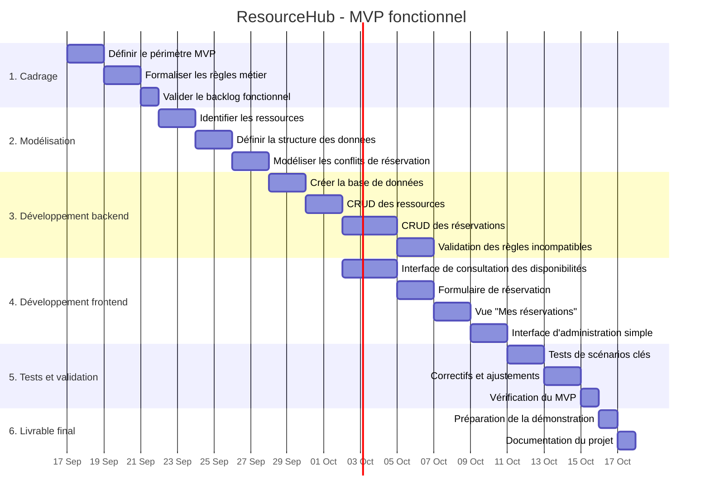
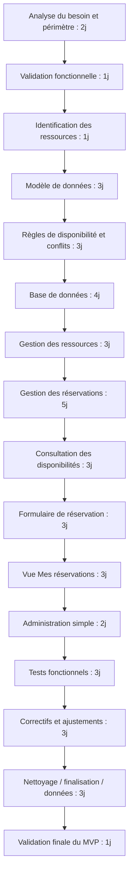

# Gantt du projet - MVP fonctionnel ResourceHub

## Objectif du plan
Ce Gantt vise le minimum viable pour un projet fonctionnel :
- consulter les disponibilités,
- réserver une ressource,
- empêcher les réservations incompatibles,
- consulter l'historique des réservations.

Il est construit à partir des intentions exprimées dans les documents du projet : besoin, utilisateur principal, proposition de valeur, hypothèses, limites et usages clés.

## Livrable minimum fonctionnel retenu
Le MVP doit permettre de :
1. afficher la disponibilité des ressources selon la date et la plage horaire,
2. créer une réservation pour une salle, un véhicule, un ordinateur ou un équipement,
3. bloquer les conflits de réservation sur une même ressource,
4. afficher les réservations de l'utilisateur et leur historique,
5. gérer un minimum d'administration des ressources.

---

## Planning estimé (2 à 3 semaines)

---

## Détail des tâches

### 1. Cadrage
- Définir le périmètre du MVP : éviter le sur-qualification du projet.
- Choisir les ressources couvertes : salle, véhicule, ordinateur, équipement partagé.
- Définir les usages prioritaires : consultation, réservation, historique, blocage de conflit.

### 2. Modélisation
- Créer les objets métier : Ressource, Utilisateur, Réservation, Type de ressource.
- Définir la logique de disponibilité : date, heure de début, heure de fin.
- Définir les règles d'incompatibilité : une ressource ne peut pas être réservée à deux moments chevauchants par des utilisateurs différents.

### 3. Développement backend
- Structurer la base de données.
- Implémenter la création, lecture, modification et suppression des ressources.
- Implémenter la création et l'affichage des réservations.
- Ajouter la logique de validation : si la ressource est déjà réservée sur la plage demandée, la réservation est refusée.

### 4. Développement frontend
- Créer une page de consultation des disponibilités.
- Ajouter un formulaire de réservation simple avec date, heure, durée, titre, description.
- Ajouter une page "Mes réservations" pour suivre l'historique.
- Ajouter un panneau d'administration minimal pour gérer les ressources.

### 5. Tests et validation
- Tester la disponibilité d'une ressource libre.
- Tester la réservation réussie.
- Tester le blocage d'une réservation chevauchante.
- Tester la consultation du calendrier et de l'historique.
- Vérifier le comportement sur plusieurs types de ressources.

### 6. Livrable final
- Préparer une démonstration du MVP.
- documenter les fonctionnalités restantes hors périmètre.

---

## Critique path (chemin critique)
Les tâches les plus sensibles pour le MVP sont :
1. la modélisation des réservations,
2. la logique anti-conflit,
3. la consultation des disponibilités,
4. la création de réservation,
5. la validation fonctionnelle finale.

Si ces étapes sont validées, le projet couvre le cœur du besoin métier.

---

## Schéma fonctionnel du MVP
Le minimum fonctionnel doit permettre au moins ce flux :
- l'utilisateur choisit une ressource,
- il consulte les disponibilités,
- il sélectionne une période libre,
- il crée une réservation,
- le système vérifie la disponibilité,
- la réservation est acceptée ou refusée,
- l'utilisateur visualise sa réservation dans l'historique.

---

## Conclusion
Le planning ci-dessus est le plan minimal réaliste pour livrer une version utile du produit. Il respecte les intentions du projet sans s'étendre vers des fonctions hors périmètre comme la facturation, la maintenance ou la collaboration avancée.

---

## Version Mermaid - PERT du projet

Le chemin critique est la séquence A → B → C → D → E → F → G → H → I → J → K → L → M → N → O → P, car c'est la suite de tâches qui conditionne la durée minimale du projet.
